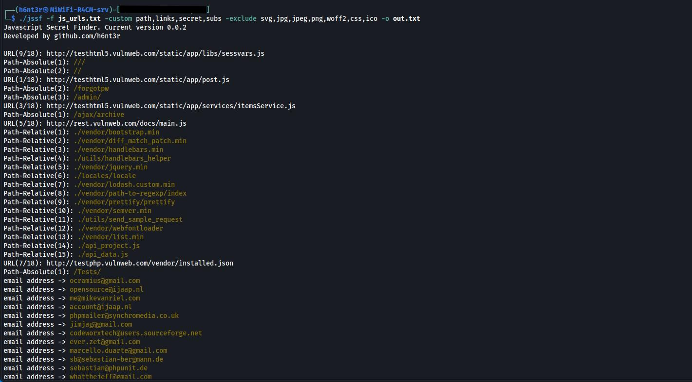

## 🔎 Advance JavaScript Secret Finding tool


## 🚀 Features
- **Massive Pattern Coverage:**
    - Modern and legacy API keys, OAuth tokens, secrets, JWTs, session cookies, cloud credentials, blockchain/web3 keys, AI/ML API keys, mobile and IoT secrets, and more.
    - Supports Google, AWS, Azure, Facebook, Twitter, Discord, Telegram, Stripe, Shopify, GitHub, GitLab, Bitbucket, Cloudflare, Heroku, Vercel, Netlify, Supabase, OpenAI, HuggingFace, and dozens of other services.
- **Path/Endpoint Extract:**
    - Relative, Absolute, Home-Relative
- **Links Extract:**
    - Relative, Absolute
- **Subdomain Extract:**
    - Extract subdomain only in scope. Current url `root` domain is scope.
- **Exclude Extensions:**
    - Remove extensions from `path,link,url`

## 👑 Supported Secret Types (Partial List)
- Google API, OAuth, Maps, Analytics, Firebase, GCP Service Accounts
- AWS Access/Secret Keys, MWS, S3 URLs, Session Tokens
- Azure, Office365, Teams, IBM, Oracle, Alibaba, Salesforce, SAP
- GitHub, GitLab, Bitbucket, Atlassian, Copilot, Runner Tokens
- Facebook, Twitter, LinkedIn, Discord, Telegram, Slack, Zoom
- Stripe, PayPal, Square, Shopify, Mailgun, SendGrid, Mailchimp, Pusher, Algolia, Sentry, Mixpanel
- OpenAI, HuggingFace, Expo, Android/iOS, MQTT, Okta, ServiceNow, Vault, Docker, Kubernetes, Jenkins, CircleCI, TravisCI
- Blockchain/Web3: Ethereum, Infura, Alchemy, etc.
- JWTs, Session Cookies, Bearer/OAuth tokens, CSRF/XSRF tokens
- Generic API keys, secrets, and custom patterns
- SMTP, Redis, RabbitMQ, MongoDB, PostgreSQL, MySQL, Elasticsearch, and more
- PEM, DSA, EC, PGP, SSH private keys, dotenv, and critical config files

### Options:
```
jssf -h
Usage of jssf:
  -custom string
    	Custom mode: comma-separated list of modes (links,path,secret,subs)
  -exclude string
    	Comma-separated list of extensions to exclude (e.g. png,jpg,svg)
  -f string
    	Scan a file (each line is a URL)
  -h	Show help
  -links
    	Extract in-scope links (relative + absolute)
  -o string
    	Save output to plain text file (optional)
  -path
    	Extract file system paths (absolute, relative, home-relative)
  -s	Silent mode (hide banner and summary)
  -secret
    	Detect secret patterns using regex (from patterns.go)
  -subs
    	Extract only subdomains for the target's root domain (exclusive with -links)
  -thread int
    	Number of concurrent threads (default 5)
  -timeout int
    	HTTP request timeout in seconds (default 5)
  -u string
    	Scan a single URL (http[s]://...)
```
## Usage:
* Piping mode
```
cat urls.txt | jssf -secret -o out.txt
```
* Single url scanning
```
jssf -u "http://testphp.vulnweb.com/medias/js/common_functions.js" -secret -o out.txt
```
* File contain `JS` url `secret` scanning
* In file `cat javascript_urls.txt` should contain looks like this:
```
http://testhtml5.vulnweb.com/static/app/post.js
http://vulnweb.com/wp-content/themes/twentyeleven/js/html5.js
http://testhtml5.vulnweb.com/static/app/services/itemsService.js
http://testphp.vulnweb.com/medias/js/common_functions.js
http://rest.vulnweb.com/docs/main.js
http://testphp.vulnweb.com/.well-known/ai-plugin.json
http://testphp.vulnweb.com/vendor/installed.json
http://rest.vulnweb.com/docs/vendor/polyfill.js
http://testhtml5.vulnweb.com/static/app/libs/sessvars.js
http://www.vulnweb.com/usr/themes/lanstar-master/assets/js/lanstarApp.js
http://rest.vulnweb.com/docs/vendor/require.min.js
http://testphp.vulnweb.com/bxss/test.js
```
```
jssf -f javascript_urls.txt -secret -o out.txt
```
* File contain `JS` url with all `links,path,secret,subs` scanning
```
jssf -f javascript_urls.txt -custom links,path,secret,subs -o out.txt
```
* File with silent scanning
```
jssf -f javascript_urls.txt -secret -s -o out.txt
```
* My favourite scanning mode
```
jssf -f javascript_urls.txt -custom links,path,secret,subs -exclude svg,jpg,jpeg,png,woff2,css,ico -o out.txt
```
## Installation
```
go install -v github.com/h6nt3r/jssf@latest
```
## Binary Build
```
git clone https://github.com/h6nt3r/jssf.git
cd jssf
go build -o jssf jssf.go patterns.go
sudo mv jssf /usr/local/bin/
cd
jssf -h
```